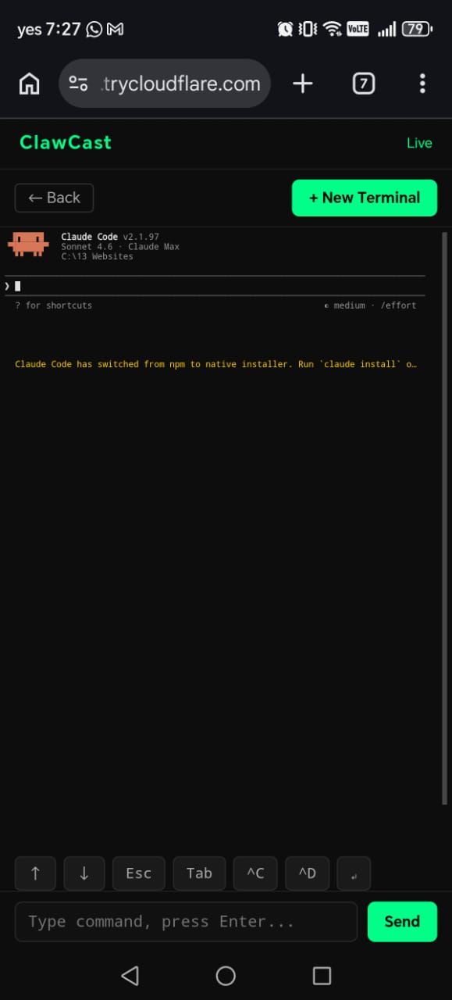

# ClawCast

**Mirror your VS Code terminals to any phone. Bidirectional. No SSH. No subscription. No app.**



---

## Install

### 1. Install cloudflared

```bash
# macOS
brew install cloudflared

# Windows
winget install Cloudflare.cloudflared

# Linux (Debian/Ubuntu)
curl -L https://pkg.cloudflare.com/cloudflare-main.gpg | sudo tee /usr/share/keyrings/cloudflare-archive-keyring.gpg > /dev/null
echo "deb [signed-by=/usr/share/keyrings/cloudflare-archive-keyring.gpg] https://pkg.cloudflare.com/cloudflared $(lsb_release -cs) main" | sudo tee /etc/apt/sources.list.d/cloudflared.list
sudo apt update && sudo apt install cloudflared
```

> **Windows users:** a bundled `cloudflared.exe` is included in the release `.vsix` — you can skip this step.

### 2. Install the extension

Download `clawcast-x.x.x.vsix` from [Releases](../../releases) and drag it into VS Code's Extensions panel, or:

```bash
code --install-extension clawcast-x.x.x.vsix
```

### 3. Start mirroring

`Ctrl+Shift+P` → **ClawCast: Start Mirror**

A QR code appears in a side panel. Scan it on your phone. Your terminals stream live.

---

## Quick start

Once the extension is installed:

1. `Ctrl+Shift+P` → **ClawCast: Start Mirror** — a QR code appears in a VS Code side panel
2. Scan the QR with your phone's browser (any browser, no app needed)
3. Back in VS Code on your desktop, open a new terminal — `Ctrl+`` or **Terminal → New Terminal**
4. That terminal streams live to your phone. Type commands straight from your phone's keyboard, hit send, and they run in VS Code

That's it. Your phone is now a fully interactive terminal window for your machine.

---

## Features

- **Grid view** — see all open VS Code terminals at once
- **Full-screen** — tap any terminal to expand it
- **Bidirectional input** — type commands from your phone, they run in VS Code
- **Spawn terminals** — create a new terminal from your phone
- **Close terminals** — long-press a card to kill it in VS Code
- **Auto-reconnect** — network drops are handled gracefully
- **Session token auth** — QR URL carries a one-time token, regenerated each session
- **Zero config** — no login screen, no API key, no port forwarding

---

## How it compares

A few tools exist in this space. Here's an honest, factual breakdown:

| Dimension | Claude `/remote` | VS Code Mobile | **ClawCast** |
|---|---|---|---|
| **Core function** | AI session streaming | Full VS Code remote | Raw PTY terminal mirror |
| **Price** | Pro subscription (~$20/mo) | ~$2/month | Free forever |
| **Infrastructure** | Anthropic cloud | Cloud-hosted | Self-hosted |
| **Auth** | OAuth via claude.ai | Google sign-in required | QR session token — no account |
| **Terminal input** | ❌ Read-only | ✅ Terminal control | ✅ Full bidirectional PTY |
| **Multi-terminal grid** | ❌ Single session view | ❌ Single terminal | ✅ All terminals simultaneously |
| **Spawn terminals** | ❌ | ❌ | ✅ From phone |
| **Close terminals** | ❌ | ❌ | ✅ Long-press |
| **Data privacy** | Routes via Anthropic | Routes via their servers | Never leaves your network |
| **CGNAT bypass** | ✅ | Unknown | ✅ cloudflared |
| **No account needed** | ❌ | ❌ | ✅ |
| **No app needed** | ❌ Claude app required | ❌ Account required | ✅ Any browser |
| **Claude required** | ✅ | ❌ | ❌ |
| **Latency** | ~100–500ms | Unknown | ~20–100ms |

Each tool has its own focus. Claude `/remote` is built for monitoring AI sessions. VS Code Mobile offers a full remote IDE experience. ClawCast is narrower in scope — raw terminal mirroring, free, self-hosted, no account.

---

## How it works

```
┌─────────────────┐     WebSocket      ┌──────────────────┐     cloudflared      ┌───────────────┐
│  VS Code        │ ─────────────────► │  Relay (embedded │ ──────────────────► │  Your phone   │
│  Extension      │                    │  in extension)   │    free tunnel       │  (any browser)│
│  (terminal tap) │ ◄───────────────── │  serves web UI   │ ◄────────────────── │               │
└─────────────────┘    input/resize    └──────────────────┘                     └───────────────┘
```

- The **VS Code extension** taps all terminals via the `onDidStartTerminalShellExecution` API and buffers their output
- An **embedded relay** (HTTP + WebSocket server, port 3747) runs inside the extension process — no separate server to manage
- **cloudflared** creates a free HTTPS tunnel, no Cloudflare account required, punches through any NAT or CGNAT
- The **phone browser** connects to the tunnel URL, renders terminals with xterm.js, and sends input back
- **ClawCast PTY terminals** (spawned via "+ New Terminal") get full resize support — dims sync from phone's fitAddon
- A **session token** is embedded in the QR URL and validated on every connection — no unauthorized access

---

## Known limitations

> ClawCast is a hobbyist project — built out of curiosity, not a product roadmap. It works, and it's genuinely useful day-to-day, but it's not polished commercial software. Here's what you should know going in:

- **New terminals only.** ClawCast only picks up terminals opened *after* you start the mirror. Pre-existing terminals won't stream live output — VS Code's API doesn't expose raw PTY data for terminals it didn't spawn. The fix is simple: after scanning the QR, just open one or two fresh terminals in VS Code (`Ctrl+`` or Terminal → New Terminal). Alternatively, tap **+ New Terminal** in the phone UI to spawn one directly from your phone. Either way, you get full control fast without needing to restart anything.

- **Terminal width doesn't auto-fit your phone.** If your VS Code terminal panel is wide on the desktop, the output won't reflow to match your phone's screen — which can cause overlapping text or garbled output. The workaround: drag your VS Code terminal panel narrower until its width roughly matches your phone before running anything. Terminals spawned *from* the phone (via **+ New Terminal**) handle resize automatically — dims sync from the phone's xterm.js instance.

- **cloudflared required.** A free tunnel binary handles the CGNAT-busting. Windows users get it bundled inside the `.vsix` — nothing to install. Mac/Linux users run `brew install cloudflared` or the equivalent once.

---

## Building from source

```bash
git clone https://github.com/alyfe-how/clawcast
cd clawcast/extension
npm install
npm run package     # produces clawcast-x.x.x.vsix
```

Requires Node.js 18+, `@vscode/vsce` (installed as devDependency).

---

## Roadmap

- [ ] macOS/Linux bundled cloudflared binary in release
- [ ] Virtual keyboard on mobile
- [x] Multiple simultaneous viewers
- [x] Session token auth (QR URL, auto-generated per session)
- [ ] VS Code Marketplace publish

PRs welcome.

---

## ⭐ If ClawCast helped you

If ClawCast saved you from setting up SSH, or did something Remote Control couldn't — a GitHub star goes a long way.

It helps other developers find it. And if we hit 5,000 stars, Anthropic gives me free Claude Max credits to keep building tools like this. 🙏

---

## License

MIT — free forever. See [LICENSE](LICENSE).

---

## About

**Made with ❤️ by [Alyfe How](https://github.com/alyfe-how)**
Contact: alyfe.how@gmail.com
